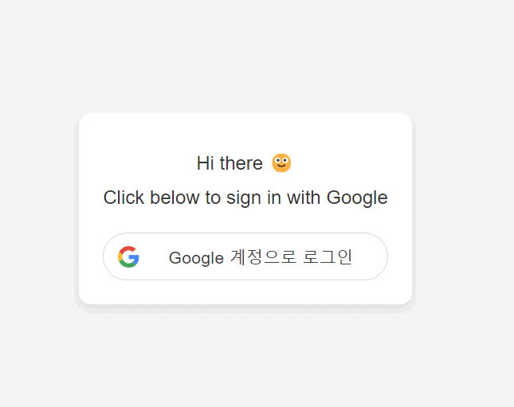

# simple django google login

## TO DO LIST

1. make venv, .gitignore, a.sh, REAMDME.md
2. pip install django python-dotenv google-api-python-client
3. django-admin startproejct config .
4. python manage.py startapp auth
5. add app(auth) to the INSTALLED_APPS in settings.py

# <a href="https://www.photondesigner.com/articles/google-sign-in?ref=yt-google-sign-in">instruction</a>
